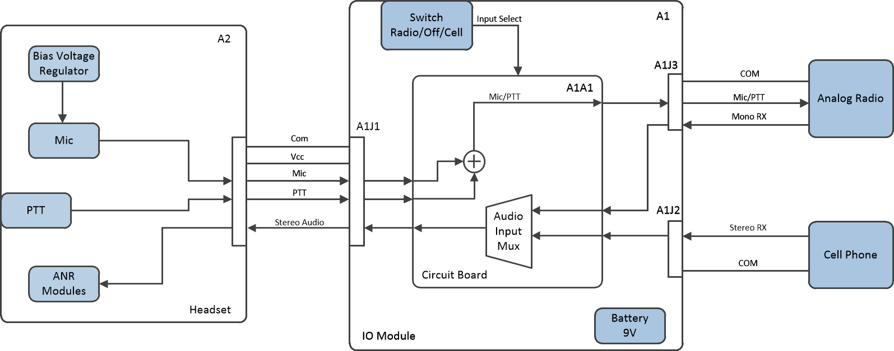
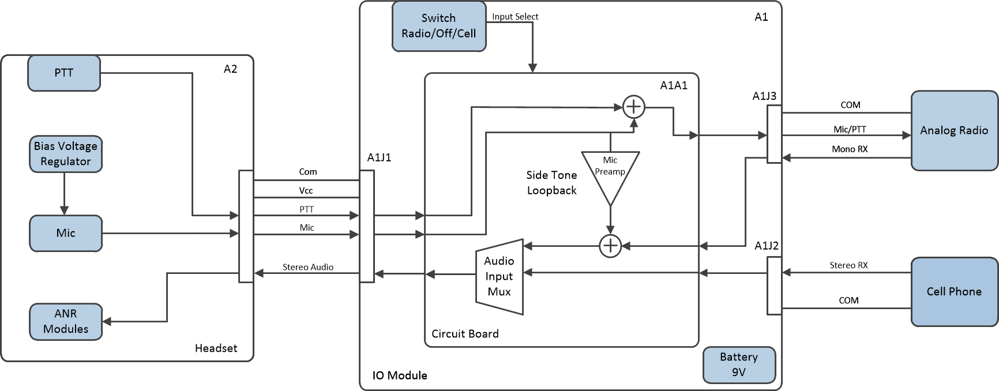
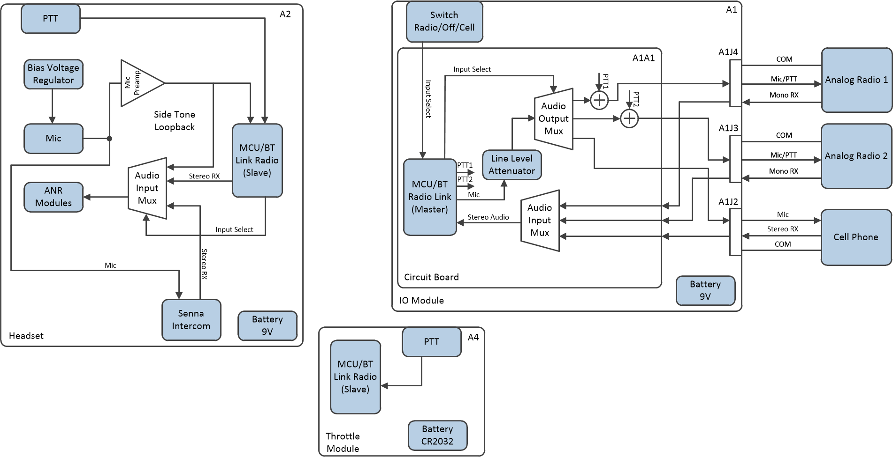

# Ultralight Headset
This is a project to make a better communications headset for ultralights, but specifically for paramotors. 

## Goals
- Modularity - Everyone's needs and budget are a little different, so we want to make it possible put together certain features a la carte.
- ANR - Active noise cancelation modules are rare for UL headsets, but they are the only way of effectively attenuating the low frequencies generated by our two stroke engines and prop. 
- Wireless links - The helmet itself should have a wireless link to other system components. Reducing the number of wires around us is not only convenient, but also an important safety improvement. This should also reduce cost and labor by eliminating a complex cable assembly, and expensive connectors.
- Radio connectivity - The system should accommodate at least two simultaneous analog radios, cell phone connectivity, and bluetooth intercom.  
- Side tone - The system should feed the microphone signal back into the speakers for the comfort of the user. 

## Roadmap
The roadmap lays out the requirements for each version of the headset along its development. 

### Version 1.0

Version 1 and its derivatives have a fully wired interface between all modules. The first version supports a single radio, and audio input from an AUX jack. 

### Version 1.1

Version 1.1 will change the following items.

- Side tone support. Side tone plays audio from the microphone back through the speakers to allow the user to hear themselves speak. The greatly improves the comfort of speaking. 

- A generic pigtail drawing will be added so cable for arbitrary radios can easily be constructed. 

### Version 2.0

Version 2.0 will involve a major redesign, and significantly increase the design complexity of the headset. However, it should hopefully reduce overall cost and build difficulty. 

The following things will be completed for 2.0:

- The link between the IO Module and the Headset will be changed to a bluetooth interface. 

- The IO Module Case will be changed, and support for one additional analog radio will be added. 

- The connecters may be changed to reduce cost. 

- The radio toggle interface will need to be changed

- Support for Senna intercom may be added in a subversion.

- Throttle PTT will be added, but may be pushed to 2.1

- A battery will be added to the headset. 

- The microphone on the headset will change to a more robust aviation style

- Microphone input will be added to the aux jack

## Drawing Numbering and Style Guide

This is still WIP. For now I am trying to use a formal drawing tree. Drawings from various CAD softwares are printed to PDF and controlled in the Git repository, and source files will be kept in their own folder. Configuration management is TBD, but for the most part we will just add dash numbers to drawings of major changes to systems. 
Minor changes will be reflected by a change in the revision letter.  I will need to set up some configuration management spreadsheet to identify which dash numbers go into each version.  

## CAD Software 
Currently, Fusion360 is being used for mechanical CAD. Due to major shortcomings with the drafting module, it would be desirable to move to Solidworks. Solidworks is normally very expensive but is available through the EAA for use on open source projects. 
In the meantime, I'd be happy to add you to the Fusion360 project if you email me. There isn't any obvious way to link to it as a public repo.

Certain drawings are maintained on sheets, which has the advantage of being free, and the major disadvantage of not having version control synced with the repository. 
[Wirelists for A1300](https://docs.google.com/spreadsheets/d/1odUo59O54lUUatiMipqJTk2xvd_l8rzADcac63PmRdw/edit?usp=sharing)
[Partlists](https://docs.google.com/spreadsheets/d/1oErzroamnteU2tq9hoaM70eOOeuBpsWLLE8QT7xZNOo/edit?usp=sharing)
[Drawing Tree](https://docs.google.com/spreadsheets/d/1H3n_jioX6qo1rZ_G6kWBhMTz45Bp03Awh5uix86TeiI/edit?usp=sharing)

KiCad will be used for electrical schematics and PCBs. 

Currently, we don't really have proper wiring diagrams, but these will probably be done with AutoCad electrical, due to a total lack of free software to do the job. There aren't any reasonably priced ways to get AutoCad unless you are a student, so finding a work around will be up to you. 

## Assembly Guide

I was going to write up a detailed assembly guide, but at this point the project isn't really in a solid enough state to be used by someone who can't figure it out well enough from the drawings. This will have to wait for 2.0. 

